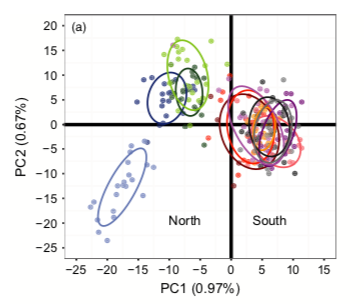
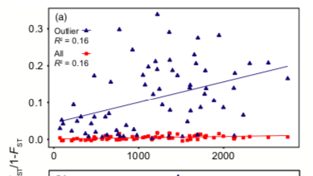

# Background

As an assignment for Dr. Christopher Schmitt's [Project Design & Statistics course](https://fuzzyatelin.github.io/bioanth-stats/overview.html) at Boston University, we were asked to choose a scientific paper in order to replicate analyses. I chose Mallory Van Wyngaarden's [2016 population genetics paper on sea scallops](https://www.ncbi.nlm.nih.gov/pmc/articles/PMC5192885/). 

## About the study

The study sampled sea scallops from locations across the East Coast of the US & Canada & conducted RAD sequencing.

## Accessing the data

All raw sequencing is publicly available at NCBI's short read archive, project: [PRJNA340326](https://www.ncbi.nlm.nih.gov/bioproject/PRJNA340326/). I'm not going to use the raw data because there are too many steps & gaps between this raw data & later analyses that I wouldn't be able to fill without asking the authors. 

Instead, the authors kindly provide a .vcf file with the single nucleotide polymorphisms (SNPs) listed [here](https://datadryad.org/stash/dataset/doi:10.5061/dryad.2nh23). There's a button on the rightside column that says "Download dataset ~ 7 MB". The authors note that this file contains the 7,216 SNPs present before filtering for Hardy-Weinberg Equilibrium (HWE).

# Getting started

## Filter for Hardy-Weinberg Equilibrium (HWE)

Authors found that 7,163 SNPs (out of 7,216 total) met HWE assumptions.

Loci were filtered for HWE p value < 0.05 in 6 or more populations. I couldn't figure out how to do it in Genepop like the authors did, but followed the instructions from ddocent for HWE SNP filtering [here](http://www.ddocent.com/filtering/) & did it that way. 

First, you have to have your vcf file, a 2-column tab-delimited file that lists your sample name in the first column & the population in the second column, the custom script from ddocent (raw script located [here](https://github.com/jpuritz/dDocent/raw/master/scripts/filter_hwe_by_pop.pl), I named it "filter.pl") and access to a few programs: vcflib & vcftools. Luckily these programs are on my computer's super computing cluster.

I'm in Unix here, using Terminal on Mac. I logged into BU's super computing cluster. I downloaded the .vcf file from the dryad site above & put it in my local directory. I also made a 2-column tab-separated file called 'pops.inds' which has the sample names in one column & the population they belong to in the second column (gleaned this information from their well designed sampling name scheme in the vcf file)

```{bash, eval = FALSE}
#loading necessary programs
module load vcflib
module load vcftools

#I have to make the local script exectuable
chmod +x ./filter.pl

#first doing a few processing things for setting up the vcf for filtering
#this is copied from the ddocent website: "Let’s filter our SNPs by population specific HWE. First, we need to convert our variant calls to SNPs. To do this we will use another command from vcflib called vcfallelicprimatives"
vcfallelicprimitives VanWyngaardenM_etal_PopStructure_SNPMap4b.vcf --keep-info --keep-geno > DP3g95p5maf05.prim.vcf

#more from ddocent: This will decompose complex variant calls into phased SNP and INDEL genotypes and keep the INFO flags for loci and genotypes. Next, we can feed this VCF file into VCFtools to remove indels."
vcftools --vcf DP3g95p5maf05.prim.vcf --remove-indels --recode --recode-INFO-all --out SNP.DP3g95p5maf05

#now for the HWE filter:
./filter.pl -v SNP.DP3g95p5maf05.recode.vcf -p pops.inds -o SNP.DP3g95p5maf05.HWE -h 0.05 -c 0.42
#filter.pl is the local script
#pops.inds is my 2-column samples & populations file
#-o is the output
#-h is my alpha for HWE, the authors did 0.05 (i.e. p < 0.05)
#-c is specifying that I only want the site gone if it shows up in 7/12 populations

#output looks like this:
#Outputting results of HWE test for filtered loci to 'filtered.hwe'
#Kept 7163 of a possible 7216 loci (filtered 53 loci)
```

53 loci is exactly how many the authors said were removed during their HWE filtering - dope. 

```{bash, eval = FALSE}
#Finally just renaming the unwieldy output that ddocent gives you in their pipeline
mv SNP.DP3g95p5maf05.HWE.recode.vcf scallops.vcf
#honestly what on earth is that naming scheme
```

# Plotting PCA

Now time for some plotting. I transferred the new .vcf file to my local directory.

The authors say they use adegenet to make the PCA. In the next part of code I also use adegenet, but I think they had slightly different input data, perhaps genepop formatted data input rather than the .vcf that I use.

```{r}
#install.packages("vcfR")
suppressMessages(library(vcfR))
suppressMessages(library(adegenet))
suppressMessages(library(vegan))
#suppressMessages(library(stringr))

#convert vcf to a genlight object for plotting
gl=vcfR2genlight(read.vcfR("scallops.vcf")) 

#reading in population information
pops=read.table("pops.inds",sep="\t") 

#assigning populations to the genlight object
pop(gl)=pops$V2 

#make the pca
pca=glPca(gl,nf=3,parallel=F) 
#nf means the number of principal components to retain, here we do 3
#parallel would just be a threads processing thing, not doing that here

#plotting
plot(pca$scores[,1:2],col=transp(as.numeric(as.factor(pop(gl))),0.3),pch=19)
ordiellipse(pca$scores[,1:2],pops$V2,label=F,draw="lines")
```

The authors' PCA for comparison:



So I get the mirror image of the author's figure for some reason. But the pattern holds: the one divergent site by itself, then three sites clustering together, and then all the other sites together in a big mess.

# Expected heterozgyosity analysis

The authors report the expected heterozygosity average +/- the standard deviation. They said they used gstudio for that, but that requires the genepop format of the data, while I have a vcf, so I'm using hierfstat from a vcf to genind object instead because that's what I could figure out how to use.

```{r}
library(hierfstat)
library(adegenet)

#read in the data 
vcf <- read.vcfR("scallops.vcf")
#read in the population files
pop <- read.table("pops.inds")
#transform vcf file to genind object
genind <- vcfR2genind(vcf)
#assign populations
pop(genind) <- pop$V2

#calculate diversity statistics
div <- summary(genind)
#my attempts to extract just the expected heterozygosity data - there's definitely an easier way
het <- as.data.frame(div[["Hexp"]])
new <- c(het[1:7163,])
new2 <- as.data.frame(new)

#finally, the mean & standard deviation of the expected heterozygosity
mean(new2$new)
sd(new2$new)
```

The authors reported the same thing as me: "expected heterozygosity averaged 0.2710 ± 0.1333 (mean ± SD)"

# Isolation by distance analysis

To assess isolation by distance, authors performed a linear regression to get the R-squared value for their data's fit between the pairwise population Fst values (transformed to FST/(1-FST)) & distance (km), then assessed the significance using a Mantel test. I don't understand why the two different tests for the same data but I'll do it anyway. 

I made the ibd data file in Excel based on their provided matrices of 1. fst & 2. distance (km). Then I used these same matrices for the Mantel test. Each of these tests were done once for the Fst values based on all their loci, then again based on just outlier loci.

```{r}
#packages
suppressMessages(library(ggplot2))
suppressMessages(library(cowplot))

#read in ibd data file
ibd <- read.csv("ibd.csv")

#all the loci fst values
all <- subset(ibd,fst_type=="all")

#transforming the fst values the same way the authors do
all$fst_trans <- all$fst/(1-all$fst)

lm1 <- lm(fst_trans~km,data=all)
summary(lm1)
#super significant
#R-squared value = 0.1672
#authors reported an R2 of 0.16

#now for the outlier loci:
outliers <- subset(ibd,fst_type=="outliers")

#transforming the fst values the same way the authors do
outliers$fst_trans <- outliers$fst/(1-outliers$fst)

lm2 <- lm(fst_trans~km,data=outliers)
summary(lm2)
#super significant
#R-squared value = 0.1653
#authors reported an R2 of 0.16 again
```

Mantel test time. First for all loci, then just outlier loci. 

```{r}
library(ade4)

#read in distance data
dist <- read.csv("distance.csv",header=FALSE)
#read in fst data
fst <- read.csv("fst.csv",header=FALSE)
#transform the fst data like the authors do
fst_trans <- fst/(1-fst)
head(dist)
head(fst_trans)

#create a 'dist' matrix, required for Mantel test
dist.mat <- as.dist(dist)
fst.mat <- as.dist(fst_trans)

mantel.rtest(dist.mat,fst.mat,nrep=9999)
#p = 0.0344 for all loci

#just outlier loci now
#same distance matrix because the sites are the same
fst_out <- read.csv("fst_outliers.csv",header=FALSE)
fst_out_trans <- fst_out/(1-fst_out)
head(fst_out_trans)

#create a 'dist' matrix, required for Mantel test
fstout.mat <- as.dist(fst_out_trans)
fstout.mat

mantel.rtest(dist.mat,fstout.mat,nrep=9999)
#p-value = 0.0175
```

The authors reported p < 0.05 & p < 0.01 for their Mantel tests for all & outlier loci, respectively, which is also what I just got! Amazing. 

Plotting the results. 

```{r}
ibd$fst_trans <- ibd$fst/(1-ibd$fst)

ggplot(ibd,aes(x=km,y=fst_trans,color=fst_type,shape=fst_type))+
  geom_point()+
  theme_cowplot()+
  scale_color_manual(values=c("red","blue"))+
  scale_shape_manual(values=c(15,17))+
  geom_smooth(method = "lm",se=F)+
  xlab("Distance (km)")+
  ylab("Fst/1-Fst")
```

How the author's one looks in comparison (I just did 'a' so the y-axis cut off a bit):




